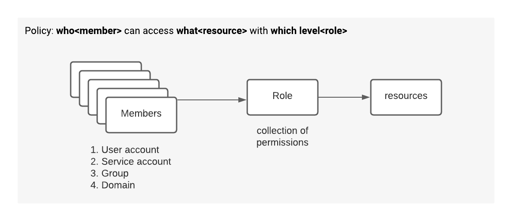

# gcp

## account configuration

currently available accounts
`gcloud auth list`

	
data array functions

- GENERATE_DATE_ARRAY
- GENERATE_DATE_ARRAY
- GENERATE_TIMESTAMP_ARRAY
- ARRAY_REVERSE

[GENEATR_DATE_ARRAY](https://cloud.google.com/bigquery/docs/reference/standard-sql/array_functions#generate_date_array)

[google platform cost calculator](https://cloud.google.com/products/calculator/)

## BigQuery

[pre-defined roles](https://cloud.google.com/bigquery/docs/access-control#bigquery)