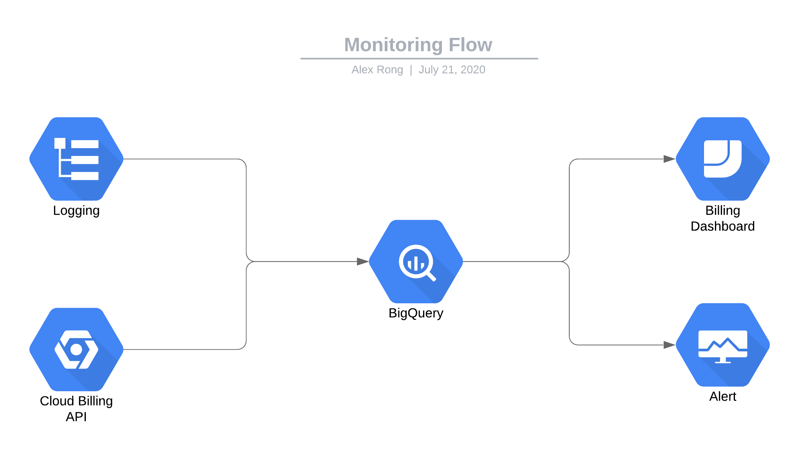

# Monitoring

- [Use Cases](#use-cases)
    - [Cost monitoring](#cost-monitoring)
    - [Performance monitoring](#performance-monitoring)

collects analyst sql script, and identify usage, think about how I can help them optimize queries, table strcutures. 


## Guidelines

- [list from datadog](https://docs.datadoghq.com/integrations/google_cloud_big_query/#data-collected)
- [BigQuery billing dashboard](https://medium.com/google-cloud/visualize-gcp-billing-using-bigquery-and-data-studio-d3e695f90c08)
- [billing dashboard template](https://datastudio.google.com/u/0/reporting/0B7GT7ZlyzUmCZHFhNDlKVENHYmc/page/dizD)

## Basic concepts 

Here contains basic concepts in GCP operations toolkits, time series model behind the scene and metric models. 

### Monitoring

Concepts

- Filtering
- Aggregation
- Alignment
- Reduction

Monitoring Models


How to reduce metrics from records/s to records number?

### Logging 

Concepts

- Logs viewer
- Logs Dashboard
- Logs-based Metrics
- Logs router (export logs to other systems e.g. BigQuery, GCS)
- Logs ingestion (how many bytes of logs ingested from various services)

[sample logging queries](https://cloud.google.com/logging/docs/view/query-library-preview#bigquery-filters)

Types

- activity (admin activity)
- data access (where contains query job info) 


## Use Cases

Here is the detailed use cases. I will start with just focusing on BigQuery. I actually want to do two parts: 

- cost monitoring to answer who did what and how much does it cost
- performance monitoring to identify time consuming queries



## Cost monitoring

Prerequisite:

- create log destination dataset with preferred location (default is US) 
- create sink to export log to destination dataset
- enable export billing data to BigQuery
- export data access log to BigQuery (from logging)

Set-up 

- [Export cloud billing data to BQ](https://cloud.google.com/billing/docs/how-to/export-data-bigquery)
- [Setup Cloud Monitoring email notifications](https://cloud.google.com/billing/docs/how-to/budgets-notification-recipients#overview)

| table name | size |
| ---- | ----- |
|EDW.FACT_VIEWING_BEHAVIOUR | 800 GB |


query condition: `Bytes processed:>10000000000` (10GB)

| query name | full data size|data scanned | optimize suggestions | executed by |
|---|---|---| ---- | ----|
| 81gb_merge_stb_restricted.sql | 682.82 GB | 80GB| |dbt cron job| 
| 3gb_merge_content_metadata.sql | 3.4GB | 3.4GB |use partition field| dbt|  
| 800gb_query_welsey_j.sql | 792GB | 792GB | materize sub table | wesley j|

Project cost overview (up to 22 July)

- dev-core (1800)
- dev-ingest (2000)
- dev-tactical (3000-5000)
- dev-dsc (2000)
- dev-dsc-babbage (2500)
- dev-data (1000)
- test-core (300)
- test-ingest (April - July 10000)
- staging-data (~500 BigQuery usage increse)
- staging-ds (~2000)
- shared (100)
- prod-dsc-babbage (3000)
- prod-data (10000, 50% are spent on Active Storgae in BigQuery)


## Performance Monitoring

monitored resources

- bigquery_dataset
- bigquery_project
- bigquery_biengine_model
- label by team, environment

`INFORMATION_SCHEMA.JOB` gives job metadata, not sure it's on which level though (folder/project/dataset?)

```bash
# create sinks at folder level

gcloud logging sinks create bq_audits_dev bigquery.googleapis.com/projects/fxtl-dev-data-4ea0/datasets/bq_audits_dev \
    --log-filter='resource.type="bigquery_resource"' --include-children --folder=168659765428

gcloud logging read "resource.type=bigquery_resource" --folder=168659765428

gcloud resource-manager folders list 
gcloud resource-manager folders describe <folder_id>

```


Metrics:

- Scanned bytes
- Avg query execution time by user

`data_access` log contains all metrics needed e.g execution time, scanned bytes


## postgresql monitoring metrics

https://www.datadoghq.com/blog/collect-postgresql-data-with-datadog/

- max connections
- indexes usage
- rows fetched vs rows return  
