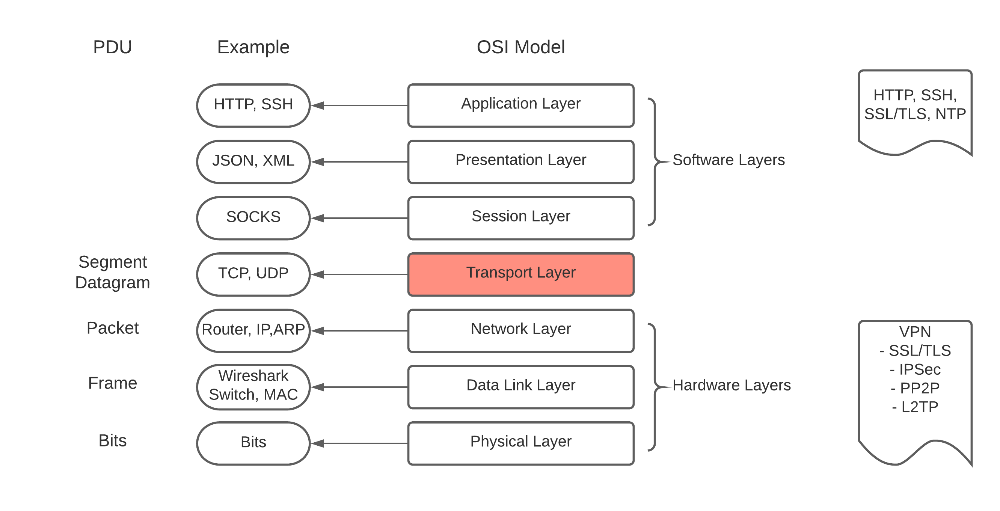

# Networking

- [Basic Model](#basic-model)
- [DNS](#dns)
- [Linux network command](#linux-network-command)
- [Network attack](#network-attack)
- [VPC](#vpc)

## Basic Model



## DNS

What is A record, CNAME, MX, Nameserver?

What is domain? host? subdomain?

What is DNS forward?

## What is socks proxy

[How socks work?](http://www.firewall.cx/vpn/vpn-guides-articles/1191-best-socks5-proxy-guide-torrenting-free-proxy-list.html)

Heartbleed bug

## What is TLS(Transport Layer Security)

https://www.cloudflare.com/learning/ssl/transport-layer-security-tls/

## What is IPSec

https://www.cloudflare.com/learning/network-layer/what-is-ipsec/

## What is a proxy server

proxy as it stands, which acts certain actions or ask for something on behalf of clients.

- A typical use case is NAT serve which sends request to public network.
- A reverse proxy directs requests to an idle server, hence client don't need to know which server the request is directed to. A typical use case is load balancer.

HAproxy: high availablity proxy server

## Linux network command

- nslookup
- ifconfig
- traceroute
- iptables
- netstat
- curl
- ping
- host
- arp: list devices in local network
- nmap: large network port scanning

```bash
# dig
# Query domain's DNS records e.g. A, MX, NS
dig servian.com any
dig +short adobe.com
dig facebook.com a @8.8.8.8

# nc(netcat)
# tcp and ucp listener, port scanner
# find open port within the given range
nc -z -v 127.0.0.1 1-1000 2>&1 | grep succeeded
```

[linux-networking-commands](https://mindmajix.com/linux-networking-commands-best-examples)

## what is DNS forward

[what is ChinaDNS?](https://github.com/shadowsocks/ChinaDNS)

 Traditional way to bypass DNS poisoning is to send all queries to a foreign DNS server via VPN. However some Chinese websites will get bad results if they have CDNs outside the country.

 The second way is to maintain a list of domains of which you want to resolve from local DNS or foreign DNS. This list changes too often, taking too much effort to maintain.

 ChinaDNS automatically queries local DNS servers to resolve Chinese domains and queries foreign DNS servers to resolve foreign domains. It is smart enough to work only with a Chinese IP range file, which doesn't change often.

## Network attack

https://www.cloudflare.com/en-au/learning/ddos/what-is-a-ddos-attack/

https://www.cloudflare.com/en-au/learning/ddos/glossary/ip-spoofing/

## OAuth 2.0

[spec](https://tools.ietf.org/html/rfc8693)

## VPC

k8s pod address range

- 10.0.0.0/8
- 172.16.0.0/12
- 192.168.0.0/16

[reserved IP addresses in a subnet](https://cloud.google.com/vpc/docs/vpc#reserved_ip_addresses_in_every_subnet)

Take 192.168.0.0/24 as example

- 192.168.0.1 default gateway(router)
- 192.168.0.255 broadcast address, which is send to all devices within the subnet


A lots of ip address range calculation is required in VPC design process, check the [link](https://cloud.google.com/kubernetes-engine/docs/how-to/alias-ips)

- Pods: 2**10
- Service: 2**12
- Nodes


## HTTP vs HTTPS

what is the different?
what is `eth0`

[Hussein Nasser Network engineer videolist](https://www.youtube.com/playlist?list=PLQnljOFTspQUBSgBXilKhRMJ1ACqr7pTr)

## TCP

- handshake
- congestion control
  - slow start


Virtual Hosts on nginx 

https://gist.github.com/soheilhy/8b94347ff8336d971ad0